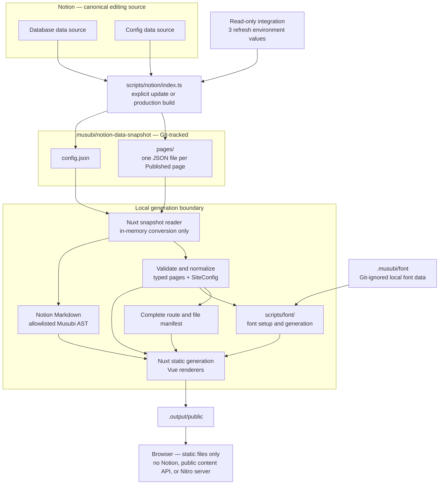

# Musubi Target Architecture

## Status

This record is the selected architecture for the current implementation. The prior prototype is historical migration evidence only: a responsibility was retained when the selected goal required it, not because the prototype already contained it.

## System overview



## Distribution and trust boundaries

- Musubi is one Nuxt application distributed as source. A user can fork it, connect a Notion workspace that follows the documented two-page contract, provide `NOTION_TOKEN`, `NOTION_DB_PAGE_ID`, and `NOTION_CONFIG_PAGE_ID`, and deploy the default website without editing source or a local configuration file. The private fetcher resolves the sole data source inside each page before querying it.
- The ordinary onboarding model is a dedicated Notion internal integration with only `Read content`, shared with the root containing both data sources. Public OAuth and broader personal workspace credentials are outside the product contract.
- Notion is the sole canonical editing source for public content and public site settings. Git Markdown, browser-side editing, multiple source adapters, and a public arbitrary-configuration interface are not product capabilities.
- Notion credentials and live source responses exist only under `scripts/notion/`. Its `index.ts` entry persists the fetched content under the Git-tracked `.musubi/notion-data-snapshot/`; local generation and application components consume those files without importing the Notion SDK or fetching the source.
- Musubi is not a Nuxt layer, independently versioned framework package, plugin system, or stable extension API. Downstream forks own their source changes and upgrades.

## Notion input contracts

### Database

The visible Notion page and its sole data source are both named `Database`. The internal implementation may still use `content` for the domain containing Posts and Pages; that internal term is not part of setup. The Database data source uses the following project-owned schema:

| Property             | Notion type    | Contract                                                                   |
| -------------------- | -------------- | -------------------------------------------------------------------------- |
| `Title`              | `title`        | Required and nonempty for every Published row                              |
| `Slug`               | `rich_text`    | Required and valid under the route contract for every Published row        |
| `Publish Date`       | `date`         | Required for every Published Post                                          |
| `Status`             | `select`       | Exactly `Draft` or `Published`                                             |
| `Type`               | `select`       | `Post` or `Page`; legacy `Content` is accepted and normalized to `Page`    |
| `Description`        | `rich_text`    | Optional supporting text and meta-description fallback                     |
| `Tags`               | `multi_select` | Optional Notion organization metadata; never creates routes                |
| `Show in Navigation` | `checkbox`     | Optional column; a missing column keeps every Page out of navigation       |
| `Navigation Order`   | `number`       | Optional column and value; a missing column or empty value means unordered |

The documented default Page template leaves `Show in Navigation` disabled. A site owner explicitly enables it for a Page that belongs in primary navigation. During migration, legacy `Content` values and the former `Date`, `ShowInNavigation`, and `NavigationOrder` property names remain compatible. Draft rows are never public. Invalid enum values, missing required Published fields, duplicate identities, and route conflicts fail generation. The underlying Database page is kept in the Dashboard's `System` area and locked against accidental view or property edits while remaining editable at the row-value level.

### Site settings

The Config data source uses `Help` (`title`), `Key` (`select`), `Value` (`rich_text`), and `Enable` (`checkbox`). Only enabled rows participate. The former title-property name `Description` remains compatible during migration. `SiteConfig` is an ordinary internal object, not a user-facing configuration system.

| Notion key         | `SiteConfig` field | Accepted value                         |
| ------------------ | ------------------ | -------------------------------------- |
| `Site Title`       | `title`            | Trimmed nonempty string                |
| `Site Description` | `description`      | Trimmed nonempty string                |
| `Author`           | `author`           | Trimmed nonempty string                |
| `Link`             | `link`             | Absolute `http:` or `https:` URL       |
| `Lang`             | `lang`             | Structurally valid BCP 47 language tag |
| `Timezone`         | `timezone`         | Valid IANA time-zone identifier        |
| `GitHub`           | `github`           | Absolute `http:` or `https:` URL       |
| `X(Twitter)`       | `x`                | Absolute `http:` or `https:` URL       |

A repository-owned `defaultSiteConfig: SiteConfig` supplies field-level fallbacks only when keys are absent. Optional social-link defaults are empty, so disabling their rows removes them from navigation. Legacy Config keys `Title` and `Description` remain compatible aliases for `Site Title` and `Site Description`; `Since` and `PostsPerPage` rows are validated but ignored because they have no current site behavior. Duplicate canonical or aliased keys, unknown enabled keys, invalid values, and failure to load the authoritative Config source fail generation; Musubi never silently publishes an entirely local fallback site after a Notion failure.

## Generation pipeline

1. `scripts/notion/index.ts`, run explicitly or at the start of a production build, paginates both data sources, filters Draft rows, retrieves every Published page body once, and persists `.musubi/notion-data-snapshot/config.json` plus one Page Data JSON file per Published page under `.musubi/notion-data-snapshot/pages/`. It applies bounded concurrency and rate-limit retry and reports failures with source and page context.
2. Development and offline `site:build` skip the online refresh, and Nuxt reads the Git-tracked Notion Data directly. Project-owned validators produce typed page metadata and one resolved `SiteConfig` in memory; they reject invalid input before any public route is emitted. This conversion does not write a second aggregated content JSON.
3. Page-as-Markdown responses are parsed into an allowlisted Musubi syntax tree. Markdown is data, never executable template code: raw HTML, MDX expressions, unsafe URL schemes, unexplained truncation, unsupported required blocks, and syntax outside the accepted dialect fail generation. A response marked truncated is accepted only when every reported unknown block is individually retrieved, confirmed as a selected optional embed, and represented in the tree.
4. Vue renderers cover paragraphs, headings below the page title, ordered and unordered lists, links, images with alternative text and captions, code, quotes, callouts, dividers, tables, tasks, and a generated table of contents. A named optional embed is isolated from the article. Notion Data preserves X embeds as source URLs only. Generation performs no X request and emits an ordinary safe link; any future browser-only enhancement is optional and cannot alter the snapshot or publication contract.
5. Image and attachment URLs remain as returned in Notion Data and are rendered remotely. The initial architecture deliberately does not download, cache, rewrite, or Git-track their bytes; expiry of a Notion-hosted URL is an accepted limitation until it causes a concrete problem.
6. Font setup and generation live under `scripts/font/`, with private caches and licensed inputs under the Git-ignored `.musubi/font/`. The build inventories body and emphasis Chinese typography separately. Default install (`postinstall`), `dev`, and `site:build` all run `font:setup`: if a verified Tsanger W04/W05 cache is missing, setup downloads the pinned pair (jsDelivr first, then `tsanger.cn`, or paired `MUSUBI_TSANGER_W04_URL` / `MUSUBI_TSANGER_W05_URL` when both are set), verifies size and SHA-256, and writes an activation marker only after the complete pair is ready. Download or verification failure fails the pipeline; `MUSUBI_TSANGER_SETUP=0` skips the download attempt only (an existing verified cache or paired `MUSUBI_TSANGER_*_PATH` files still feed `font:build`—use `vp run font:setup -- --clear` to drop the cache when forcing Fallback). Full Tsanger sources stay out of Git and public artifacts. Paired environment paths remain the highest-priority input for a builder that already manages licensed local files. When a verified source pair is available, the build creates deterministic current-corpus subsets for the two roles; otherwise it succeeds with the open-licensed fallback. Independently, the repository carries eight verified, content-addressed `Musubi CJK Fallback` WOFF2 shards under `scripts/font/prebuilt-fallback/`. They preserve every mapped code point from the pinned LXGW WenKai GB Medium source, its renamed identity, checksums, and OFL notice. An ordinary build pins the complete manifest checksum, verifies each file hash, copies the bundle into generated output, and checks that every required build-time code point is declared; it performs no fallback-font network request or conversion. The complete `ready` gate additionally decodes every WOFF2 cmap, compares it with the declared ranges, rejects shard overlap, and verifies the expected total coverage. The maintenance-only `scripts/font/rebuild-fallback.ts` recreates the checked-in bundle from the pinned source with the selected Node and WebAssembly tools. Generated Tsanger subsets and fallback shards use content-hashed WOFF2 names. `font:build` fingerprints the tracked snapshot, font implementation, dependency lockfile, prebuilt fallback, and optional local inputs under `.musubi/font/build-state.json`; it reuses an unchanged generated set only after verifying every output hash. This private content-aware reuse is separate from the disabled Vite+ task-result cache. The static preview and deployment contract give content-addressed assets a one-year immutable policy while HTML, generated CSS, and stable metadata URLs revalidate with validators. A required build-time glyph absent from the complete fallback or an invalid generated font fails generation. [DESIGN.md](./DESIGN.md) owns typography and visual use; [the technology stack](./technology-stack.md) owns the selected font tools.
7. The route builder creates and validates the complete public route and emitted-file manifest before Nuxt generation. Nuxt build-only server/API handlers may transfer source data into generated HTML or payloads, but no handler is part of the public artifact.
8. Nuxt statically renders the validated manifest through Vue. A required route or body that cannot be generated fails the build instead of producing a partial site.

## Nuxt snapshot consumption

Nuxt keeps the data path divided by responsibility:

```text
shared/
  site/
    types.ts
    create.ts
  content/
    types.ts
    parse.ts
server/
  site/
    load-snapshot.ts
    get-site.ts
  api/build/
    shell.get.ts
    home.get.ts
    blog.get.ts
    page.get.ts
app/
  pages/
  components/
```

- `server/site/load-snapshot.ts` owns filesystem access and validates `.musubi/notion-data-snapshot/config.json` plus every file under `pages/`. It makes no source-network request.
- Pure code under `shared/site/` and `shared/content/` converts the snapshot into one in-memory `Site`. `Site` contains one `SiteConfig`, ordered `Post[]` and `Page[]` collections, a route lookup, navigation, and parsed `MusubiDocument` values. `Post` and `Page` share identity, title, slug, route, description, and document fields; a `Post` additionally requires a publication date, while a `Page` carries navigation visibility and optional ordering.
- Config defaults and validation, the `Post` or `Page` choice, Markdown parsing, route construction, collision checks, Home's five newest Posts, the complete Blog order, and navigation are derived in memory. None are written back into the snapshot or into another aggregate file.
- `server/site/get-site.ts` creates the `Site` once per Node process during production generation. Development recreates it after a snapshot file changes. A missing or invalid file, duplicate slug, route conflict, invalid Config value, or unparseable required body fails with the responsible snapshot filename and source context.
- The four handlers under `server/api/build/` are thin build-time views of that `Site`: shell returns Config and navigation, Home returns Config and five Posts, Blog returns Config and all Posts, and page returns Config plus one matching `Post` or `Page`. Nuxt uses them while prerendering; they are absent from the public artifact.
- `app/pages/` selects the appropriate view and metadata, while `app/components/` renders the supplied serializable data. Browser code never reads the snapshot or receives the complete `Site` by default.
- `nuxt.config.ts` derives the prerender route list through the same snapshot-to-Site code instead of reading a separate route manifest. A separate Node process may recreate the in-memory `Site`; local deterministic conversion is intentionally preferred over a persistent cross-process aggregate.
- X URLs and remote-media URLs pass through this conversion as inert content data; the conversion performs no network request. Font generation and any future external enrichment stay outside it.

## Slug and route contract

- A Published slug is explicit and is never derived from its title. Musubi trims surrounding whitespace, normalizes the value to Unicode NFC, allows Unicode, and requires exactly one nonempty URL path segment.
- A slug must not be `.` or `..` and must not contain a slash, backslash, control character, query delimiter, fragment delimiter, or percent sign. Percent-encoded input is rejected instead of decoded so encoded separators and multiply encoded equivalents cannot create an ambiguous route; authors use raw Unicode instead.
- Comparisons use the NFC-normalized route and are case-insensitive. Diagnostics name both source rows or the source row and generated artifact involved in a conflict.
- Top-level Page slugs cannot occupy the reserved `blog`, `_musubi`, `_nuxt`, `__musubi_not_found`, `__nuxt_error`, `200`, or `404` names. The manifest additionally rejects collisions with Nuxt asset namespaces, error documents, generated routes, generated payloads, and emitted file paths rather than assuming that these fixed names are exhaustive.

The canonical public routes are:

| Surface               | Route         |
| --------------------- | ------------- |
| Five newest Posts     | `/`           |
| Complete Blog archive | `/blog`       |
| Published Post        | `/blog/:slug` |
| Published Page        | `/:slug`      |

Musubi does not generate paginated Blog routes, tag routes, Draft routes, or a public content API. Missing and unpublished content returns 404.

## Navigation and public behavior

- Published Pages with `Show in Navigation: true` form the site navigation. Rows with a numeric `Navigation Order` sort first by that number; ties and unordered rows sort by title. A missing or false value keeps a Page out of navigation without unpublishing its direct route.
- Social destinations come from `SiteConfig`, not Page rows. Tags remain optional Post metadata without navigation or route behavior.
- The site provides explicit light and warm dark themes, follows the system preference by default, and offers a reader-controlled choice. Exact tokens, layout, typography, responsive behavior, and the Kami-derived direction live in [DESIGN.md](./DESIGN.md).
- Locale-sensitive presentation resolves from `SiteConfig`; the repository defaults are `en-SG` and `Asia/Singapore`.
- The browser receives one static representation of each body. Nuxt ships its normal client runtime and extracted page payloads so full-static sites keep client navigation, hydration, and payload reuse; it does not ship a public content API, a Nitro server, or a second body runtime. Output size and transferred resources are measured from the generated artifact rather than governed by invented targets.

## Publication and failure behavior

- A production build refreshes the latest Notion state visible to that build into the same Notion Data shape used locally, then emits provider-neutral `.output/public`. Development and check builds use the Git-tracked Notion Data without source access. Cloudflare Workers Static Assets serves `.output/public` without a Worker script; `.output/server`, runtime Notion access, and a running Nitro process are unnecessary. The internal Nuxt generation command passes Nitro's `static` preset explicitly so Cloudflare CI detection cannot replace this boundary with a generated runtime-Worker deployment configuration.
- Failure of either authoritative source, invalid required content or settings, an invalid route manifest, a missing required glyph, or an incomplete prerender stops publication. Remote-media reachability is not checked in the initial architecture.
- Failure of an optional third-party embed remains local to that embed and cannot remove the surrounding article.
- The maintained example targets the `musubi` Cloudflare Worker and `musubi.hyf.me`; [Production Operations](../../docs/production.md) defines its manual Notion publication trigger, static delivery behavior, cache policy, migration rollback, and Worker version rollback. Automatic Notion webhooks, connecting the separate `hyf.me` personal source, publishing a duplicable Notion template, and formal release operations remain outside the initial product.

## Architectural decisions

- The source boundary is Git-tracked Notion Data: one Config Data JSON file and one Page Data JSON file per Published page. This keeps source access outside local generation, avoids repeated Notion fetches during development and checks, and keeps ordinary Git diffs local to the changed page. The human-vouched ruling and its limits live in [Architecture decisions](./architecture-decisions.md#git-tracked-notion-data-boundary).
- Notion retrieval is an external script subsystem rooted at `scripts/notion/index.ts`; its sole content output is the Git-tracked `.musubi/notion-data-snapshot/`. Nuxt consumes those files directly and performs Musubi-specific conversion in memory instead of writing a second aggregate such as `.musubi/site.json`. The ruling and its limits live in [Architecture decisions](./architecture-decisions.md#notion-code-and-snapshot-locations).
- Font setup and generation live under `scripts/font/`; their repository-local inputs, caches, and working data stay under the Git-ignored `.musubi/font/`. The location ruling and its limits live in [Architecture decisions](./architecture-decisions.md#font-code-and-working-data-locations).
- Nuxt reads the snapshot through `server/site/`, creates its typed `Site` in memory with pure `shared/` code, exposes only thin build-time views to pages, and never persists that Site as another aggregate. The human-vouched flow and its limits live in [Architecture decisions](./architecture-decisions.md#nuxt-snapshot-consumption-and-rendering-flow).
- Snapshot files use stable Notion page IDs and deterministic JSON, refresh atomically from the complete Published roster, and reuse only version-compatible unchanged pages. The vouched contract lives in [Architecture decisions](./architecture-decisions.md#snapshot-content-and-refresh).
- Media remains remote initially, and X remains a URL without build-time enrichment. These intentionally simple boundaries live in [Notion media remains remote initially](./architecture-decisions.md#notion-media-remains-remote-initially) and [X data stays a URL](./architecture-decisions.md#x-data-stays-a-url).
- User-facing entries are package scripts `dev`, `build`, and `preview`, plus Vite+ tasks such as `notion:setup`, `font:setup` / `font:build`, `site:build`, and `ready`. Nuxt generate remains an implementation detail inside `site:build`. The exact boundary lives in [User-facing task and network boundary](./architecture-decisions.md#user-facing-task-and-network-boundary).
- Source distribution stays a single application because Yunfei wants direct ownership and a no-source-edit default fork path, not a separately maintained downstream compatibility surface. Reconsider only if a concrete Yunfei requirement needs independent versioning.
- The official Notion Markdown response is the external body boundary, while Musubi's allowlisted syntax tree is the rendering boundary. Reconsider a different external representation only when required content is repeatedly lossy or unrepresentable.
- Static generation is the only publication mode because public pages do not need runtime source access. Reconsider only for a concrete feature that cannot be delivered from static output.
- Settings use an allowlisted typed object with field-level defaults because public configuration belongs in Notion without becoming an arbitrary framework capability. Add keys only for concrete site behavior.
- Preferred Tsanger faces are corpus-scoped because they are supplied as build inputs and their two accepted roles have different character inventories. The LXGW fallback is complete but split into stable Unicode ranges because later runtime content must remain covered without forcing every page to download the full family. Reconsider the shard boundaries only when measured page-level transfer or browser behavior shows a concrete problem.