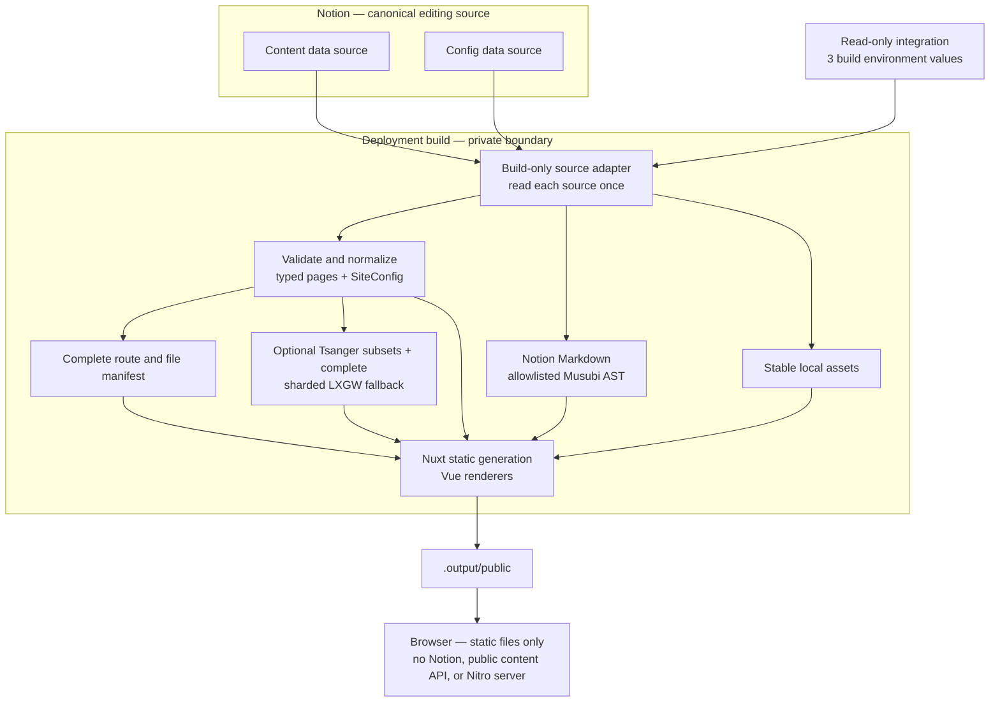

# Musubi Target Architecture

## Status

This record is the selected architecture for the current implementation. The prior prototype is historical migration evidence only: a responsibility was retained when the selected goal required it, not because the prototype already contained it.

## System overview

## Distribution and trust boundaries

- Musubi is one Nuxt application distributed as source. A user can fork it, connect a Notion workspace that follows the documented two-source contract, provide `NOTION_TOKEN`, `NOTION_CONTENT_DATA_SOURCE_ID`, and `NOTION_CONFIG_DATA_SOURCE_ID`, and deploy the default website without editing source or a local configuration file.
- The ordinary onboarding model is a dedicated Notion internal integration with only `Read content`, shared with the root containing both data sources. Public OAuth and broader personal workspace credentials are outside the product contract.
- Notion is the sole canonical editing source for public content and public site settings. Git Markdown, browser-side editing, multiple source adapters, and a public arbitrary-configuration interface are not product capabilities.
- Notion credentials and responses exist only inside the private deployment build. Application components consume project-owned types and never import Notion SDK or converter response types.
- Musubi is not a Nuxt layer, independently versioned framework package, plugin system, or stable extension API. Downstream forks own their source changes and upgrades.

## Notion input contracts

### Content

The Content data source uses the following project-owned schema:

| Property           | Notion type    | Contract                                                                   |
| ------------------ | -------------- | -------------------------------------------------------------------------- |
| `Title`            | `title`        | Required and nonempty for every Published row                              |
| `Slug`             | `rich_text`    | Required and valid under the route contract for every Published row        |
| `Date`             | `date`         | Required for every Published Post                                          |
| `Status`           | `select`       | Exactly `Draft` or `Published`                                             |
| `Type`             | `select`       | `Post` or `Page`; legacy `Content` is accepted and normalized to `Page`    |
| `Description`      | `rich_text`    | Optional summary                                                           |
| `Tags`             | `multi_select` | Optional metadata; never creates routes                                    |
| `ShowInNavigation` | `checkbox`     | Optional column; a missing column keeps every Page out of navigation       |
| `NavigationOrder`  | `number`       | Optional column and value; a missing column or empty value means unordered |

The documented default Page template leaves `ShowInNavigation` disabled. A site owner explicitly enables it for a Page that belongs in primary navigation. During migration, legacy `Content` values remain compatible and become canonical Page values before route construction. Draft rows are never public. Invalid enum values, missing required Published fields, duplicate identities, and route conflicts fail generation.

### Site settings

The Config data source uses `Description` (`title`), `Key` (`select`), `Value` (`rich_text`), and `Enable` (`checkbox`). Only enabled rows participate. `SiteConfig` is an ordinary internal object, not a user-facing configuration system.

| Notion key     | `SiteConfig` field | Accepted value                                              |
| -------------- | ------------------ | ----------------------------------------------------------- |
| `Title`        | `title`            | Trimmed nonempty string                                     |
| `Description`  | `description`      | Trimmed nonempty string                                     |
| `Author`       | `author`           | Trimmed nonempty string                                     |
| `Link`         | `link`             | Absolute `http:` or `https:` URL                            |
| `Lang`         | `lang`             | Structurally valid BCP 47 language tag                      |
| `Timezone`     | `timezone`         | Valid IANA time-zone identifier                             |
| `Since`        | `since`            | Base-10 integer year from 1 through 9999                    |
| `PostsPerPage` | `postsPerPage`     | Accepted legacy positive integer; no current route behavior |
| `GitHub`       | `github`           | Absolute `http:` or `https:` URL                            |
| `X(Twitter)`   | `x`                | Absolute `http:` or `https:` URL                            |

A repository-owned `defaultSiteConfig: SiteConfig` supplies field-level fallbacks only when optional keys are absent. Duplicate keys, unknown enabled keys, invalid values, and failure to load the authoritative Config source fail generation; Musubi never silently publishes an entirely local fallback site after a Notion failure.

## Generation pipeline

1. A build-only adapter paginates both data sources, retrieves every Published page body once, applies bounded concurrency and rate-limit retry, and reports failures with source and page context.
2. Project-owned validators produce typed page metadata and one resolved `SiteConfig`. They reject invalid input before any public route is emitted.
3. Page-as-Markdown responses are parsed into an allowlisted Musubi syntax tree. Markdown is data, never executable template code: raw HTML, MDX expressions, unsafe URL schemes, unexplained truncation, unsupported required blocks, and syntax outside the accepted dialect fail generation. A response marked truncated is accepted only when every reported unknown block is individually retrieved, confirmed as a selected optional embed, and represented in the tree.
4. Vue renderers cover paragraphs, headings below the page title, ordered and unordered lists, links, images with alternative text and captions, code, quotes, callouts, dividers, tables, tasks, and a generated table of contents. A named optional embed is isolated from the article. For X, generation requests the fixed official Publish oEmbed endpoint with bounded concurrency, timeout, and response size only to create the static readable representation, validates that the response matches the requested canonical status and author, parses only allowlisted text, line breaks, and safe links into Musubi's AST, and never renders provider HTML. That bounded oEmbed enrichment is the sole X-related generation request and cannot be used to derive widget height. Generation makes no network request and launches no local or remote browser to calculate height; future space reservation may use only deterministic local content, configuration, or defaults and cannot become a publication requirement. Failure before enrichment yields an ordinary safe link. A successful enrichment emits a complete static quotation; Musubi's lightweight browser interaction script may replace it with X's official widget. Initial widget failure retains the quotation. When the resolved Light or Dark theme changes after a widget is visible, the current iframe remains in place while a same-width hidden replacement is created with a bounded wait, then the two are swapped only after success; failure retains the prior widget. This enhancement does not require the production artifact to ship Nuxt's client runtime.
5. Notion-hosted images and files are downloaded, deduplicated, deterministically named, and rewritten to stable generated paths. A required asset failure fails generation; short-lived authenticated URLs never enter the published artifact.
6. The build inventories body and emphasis Chinese typography separately. Tsanger JinKai is an explicit per-checkout opt-in: `vp run font:setup` downloads the pinned W04/W05 pair from the official source into a private ignored cache, verifies both files, and writes an activation marker only after the complete pair is ready. Ordinary install, generation, and validation tasks never invoke setup. Paired environment paths remain the highest-priority input for a builder that already manages licensed local files. When either source is available, the build creates deterministic current-corpus subsets for the two roles; otherwise it succeeds with the open-licensed fallback. Independently, it verifies the pinned LXGW WenKai GB Medium source and publishes every mapped source code point across content-addressed Unicode-range `Musubi CJK Fallback` shards so later runtime text can resolve without rebuilding. Generated subsets and fallback shards use content-hashed WOFF2 names. The static preview and deployment contract give content-addressed assets a one-year immutable policy while HTML, generated CSS, and stable metadata URLs revalidate with validators. A required build-time glyph absent from the complete fallback or an invalid generated font fails generation. [DESIGN.md](../../DESIGN.md) owns typography and visual use; [the technology stack](./technology-stack.md) owns the selected font tools.
7. The route builder creates and validates the complete public route and emitted-file manifest before Nuxt generation. Nuxt build-only server/API handlers may transfer source data into generated HTML or payloads, but no handler is part of the public artifact.
8. Nuxt statically renders the validated manifest through Vue. A required route or body that cannot be generated fails the build instead of producing a partial site.

## Slug and route contract

- A Published slug is explicit and is never derived from its title. Musubi trims surrounding whitespace, normalizes the value to Unicode NFC, allows Unicode, and requires exactly one nonempty URL path segment.
- A slug must not be `.` or `..` and must not contain a slash, backslash, control character, query delimiter, fragment delimiter, or percent sign. Percent-encoded input is rejected instead of decoded so encoded separators and multiply encoded equivalents cannot create an ambiguous route; authors use raw Unicode instead.
- Comparisons use the NFC-normalized route and are case-insensitive. Diagnostics name both source rows or the source row and generated artifact involved in a conflict.
- Top-level Page slugs cannot occupy the reserved `blog`, `_musubi`, `_nuxt`, `__musubi_not_found`, `__nuxt_error`, `200`, or `404` names. The manifest additionally rejects collisions with Nuxt asset namespaces, error documents, generated routes, generated payloads, and emitted file paths rather than assuming that these fixed names are exhaustive.

The canonical public routes are:

| Surface               | Route         |
| --------------------- | ------------- |
| Five newest Posts     | `/`           |
| Complete Blog archive | `/blog`       |
| Published Post        | `/blog/:slug` |
| Published Page        | `/:slug`      |

Musubi does not generate paginated Blog routes, tag routes, Draft routes, or a public content API. Missing and unpublished content returns 404.

## Navigation and public behavior

- Published Pages with `ShowInNavigation: true` form the site navigation. Rows with a numeric `NavigationOrder` sort first by that number; ties and unordered rows sort by title. A missing or false value keeps a Page out of navigation without unpublishing its direct route.
- Social destinations come from `SiteConfig`, not Page rows. Tags remain optional Post metadata without navigation or route behavior.
- The site provides explicit light and warm dark themes, follows the system preference by default, and offers a reader-controlled choice. Exact tokens, layout, typography, responsive behavior, and the Kami-derived direction live in [DESIGN.md](../../DESIGN.md).
- Locale-sensitive presentation resolves from `SiteConfig`; the repository defaults are `en-SG` and `Asia/Singapore`.
- The browser receives one static representation of each body and no unnecessary application runtime. Output size and transferred resources are measured from the generated artifact rather than governed by invented targets.

## Publication and failure behavior

- Each deployment build fetches the latest Notion state visible to that build and emits provider-neutral `.output/public`. Serving that directory alone is the complete production contract; `.output/server`, Notion access, and a running Nitro process are unnecessary.
- Failure of either authoritative source, invalid required content or settings, an unstabilized required asset, an invalid route manifest, a missing required glyph, or an incomplete prerender stops publication.
- Failure of an optional third-party embed remains local to that embed and cannot remove the surrounding article.
- The maintained example uses the existing `musubi` Vercel project and `musubi.hyf.me`; [Production Operations](../../docs/production.md) defines its manual Notion publication trigger, preview promotion, cache behavior, and rollback. Automatic Notion webhooks, connecting the separate `hyf.me` personal source, publishing a duplicable Notion template, and formal release operations remain outside the initial product.

## Architectural decisions

- Source distribution stays a single application because Yunfei wants direct ownership and a no-source-edit default fork path, not a separately maintained downstream compatibility surface. Reconsider only if a concrete Yunfei requirement needs independent versioning.
- The official Notion Markdown response is the external body boundary, while Musubi's allowlisted syntax tree is the rendering boundary. Reconsider a different external representation only when required content is repeatedly lossy or unrepresentable.
- Static generation is the only publication mode because public pages do not need runtime source access. Reconsider only for a concrete feature that cannot be delivered from static output.
- Settings use an allowlisted typed object with field-level defaults because public configuration belongs in Notion without becoming an arbitrary framework capability. Add keys only for concrete site behavior.
- Preferred Tsanger faces are corpus-scoped because they are supplied as build inputs and their two accepted roles have different character inventories. The LXGW fallback is complete but split into stable Unicode ranges because later runtime content must remain covered without forcing every page to download the full family. Reconsider the shard boundaries only when measured page-level transfer or browser behavior shows a concrete problem.