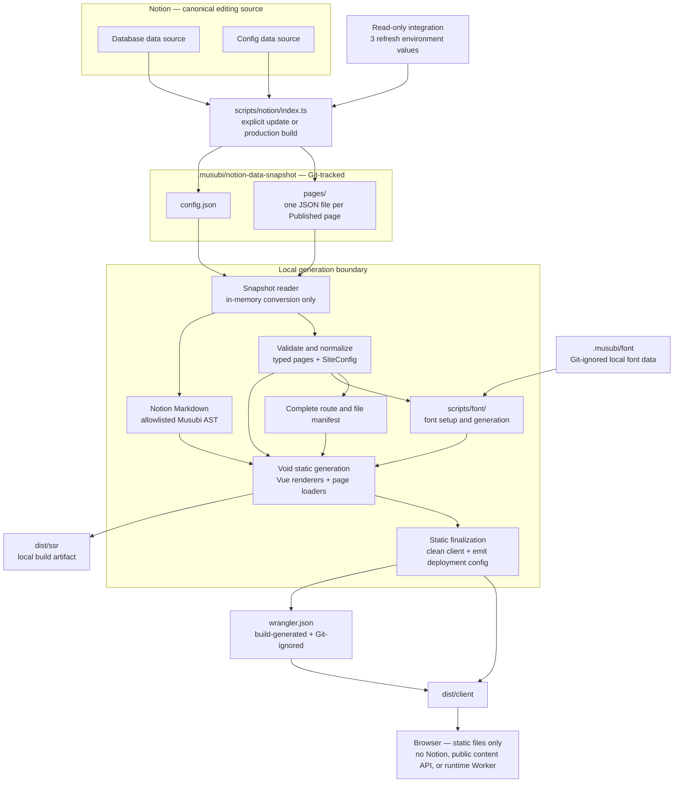

# Musubi Target Architecture

## Status

This record is the selected architecture for the current implementation. The prior prototype is historical migration evidence only: a responsibility was retained when the selected goal required it, not because the prototype already contained it.

## System overview



## Distribution and trust boundaries

- Musubi is one Void Framework application distributed as source. A user can fork it, connect a Notion workspace that supplies the current Database and Config inputs, provide `NOTION_TOKEN`, `NOTION_DB_PAGE_ID`, and `NOTION_CONFIG_PAGE_ID`, and deploy the default website without editing source or a local configuration file. The private fetcher resolves the sole data source inside each page before querying it.
- The ordinary onboarding model is a dedicated Notion internal integration with only `Read content`, shared with the root containing both data sources. Public OAuth and broader personal workspace credentials are outside the product contract.
- Notion is the sole canonical editing source for public content and public site settings. Git Markdown, browser-side editing, multiple source adapters, and a public arbitrary-configuration interface are not product capabilities.
- Notion credentials and live source responses exist only under `scripts/notion/`. Its `index.ts` entry persists the fetched content under the Git-tracked `.musubi/notion-data-snapshot/`; local generation and application components consume those files without importing the Notion SDK or fetching the source.
- Musubi is not a Void Platform application, independently versioned framework package, plugin system, or stable extension API. Downstream forks own their source changes and upgrades.

## Notion input contracts

### Database

The visible Notion page and its sole data source are both named `Database`. The internal implementation may still use `content` for the domain containing Posts and Pages; that internal term is not part of setup. The Database data source uses the following project-owned schema:

| Property             | Notion type    | Contract                                                                   |
| -------------------- | -------------- | -------------------------------------------------------------------------- |
| `Title`              | `title`        | Required and nonempty for every Published row                              |
| `Slug`               | `rich_text`    | Required and valid under the route contract for every Published row        |
| `Publish Date`       | `date`         | Required for every Published Post                                          |
| `Status`             | `select`       | Exactly `Draft` or `Published`                                             |
| `Type`               | `select`       | `Post` or `Page`; legacy `Content` is accepted and normalized to `Page`    |
| `Description`        | `rich_text`    | Optional supporting text and meta-description fallback                     |
| `Tags`               | `multi_select` | Optional Notion organization metadata; never creates routes                |
| `Show in Navigation` | `checkbox`     | Optional column; a missing column keeps every Page out of navigation       |
| `Navigation Order`   | `number`       | Optional column and value; a missing column or empty value means unordered |

A site owner explicitly enables `Show in Navigation` for a Page that belongs in primary navigation. During migration, legacy `Content` values and the former `Date`, `ShowInNavigation`, and `NavigationOrder` property names remain compatible. Draft rows are never public. Invalid enum values, missing required Published fields, duplicate identities, and route conflicts fail generation. The underlying Database page is kept in the Dashboard's `System` area and locked against accidental view or property edits while remaining editable at the row-value level.

### Site settings

The Config data source uses `Help` (`title`), `Key` (`select`), `Value` (`rich_text`), and `Enable` (`checkbox`). Only enabled rows participate. The former title-property name `Description` remains compatible during migration. `SiteConfig` is an ordinary internal object, not a user-facing configuration system.

| Notion key         | `SiteConfig` field | Accepted value                         |
| ------------------ | ------------------ | -------------------------------------- |
| `Site Title`       | `title`            | Trimmed nonempty string                |
| `Site Description` | `description`      | Trimmed nonempty string                |
| `Author`           | `author`           | Trimmed nonempty string                |
| `Link`             | `link`             | Absolute `http:` or `https:` URL       |
| `Lang`             | `lang`             | Structurally valid BCP 47 language tag |
| `Timezone`         | `timezone`         | Valid IANA time-zone identifier        |
| `GitHub`           | `github`           | Absolute `http:` or `https:` URL       |
| `X(Twitter)`       | `x`                | Absolute `http:` or `https:` URL       |

A repository-owned `defaultSiteConfig: SiteConfig` supplies field-level fallbacks only when keys are absent. Optional social-link defaults are empty, so disabling their rows removes them from navigation. Legacy Config keys `Title` and `Description` remain compatible aliases for `Site Title` and `Site Description`; `Since` and `PostsPerPage` rows are validated but ignored because they have no current site behavior. Duplicate canonical or aliased keys, unknown enabled keys, invalid values, and failure to load the authoritative Config source fail generation; Musubi never silently publishes an entirely local fallback site after a Notion failure.

## Generation pipeline

1. `scripts/notion/index.ts`, run explicitly or at the start of a production build, paginates both data sources, filters Draft rows, retrieves every Published page body once, and persists `.musubi/notion-data-snapshot/config.json` plus one Page Data JSON file per Published page under `.musubi/notion-data-snapshot/pages/`. It applies bounded concurrency and rate-limit retry and reports failures with source and page context.
2. Development and offline `site:build` skip the online refresh, and the Void build reads the Git-tracked Notion Data directly. Project-owned validators produce typed page metadata and one resolved `SiteConfig` in memory; they reject invalid input before any public route is emitted. This conversion does not write a second aggregated content JSON.
3. Page-as-Markdown responses are preprocessed, then parsed into an allowlisted Musubi syntax tree. Preprocess masks Callout text braces, rewrites Notion empty blocks and void tags, and inserts blank lines at Notion block boundaries so CommonMark does not merge adjacent paragraphs, turn a following `---` into a setext heading, or absorb prose into the previous list (see [gotchas](./gotchas.md#notion-markdown-block-boundaries-vs-commonmark)). Markdown is data, never executable template code: raw HTML, MDX expressions, unsafe URL schemes, unexplained truncation, unsupported required blocks, and syntax outside the accepted dialect fail generation. A response marked truncated is accepted only when every reported unknown block is individually retrieved, confirmed as a selected optional embed, and represented in the tree. Callout source `icon` and `color` stay on the AST and are not rendered ([DESIGN-decisions](./DESIGN-decisions.md#callout-source-icon-and-color-are-model-only)).
4. Vue renderers cover paragraphs, headings below the page title, ordered and unordered lists, links, images with alternative text and captions, code, quotes, callouts, dividers, tables, tasks, and a generated table of contents. A named optional embed is isolated from the article. Notion Data preserves X embeds as source URLs only. Generation performs no X request and emits an ordinary safe link; any future browser-only enhancement is optional and cannot alter the snapshot or publication contract.
5. Image and attachment URLs remain as returned in Notion Data and are rendered remotely. The initial architecture deliberately does not download, cache, rewrite, or Git-track their bytes; expiry of a Notion-hosted URL is an accepted limitation until it causes a concrete problem.
6. Font setup and generation live under `scripts/font/`, with private caches and licensed inputs under the Git-ignored `.musubi/font/`. Default install (`postinstall`), `dev`, and `site:build` all run `font:setup`. Setup downloads and checksum-verifies pinned Charter and JetBrains Mono WOFF2 sources into `.musubi/font/latin/`; these open-licensed inputs are required. It separately prepares the pinned Tsanger W04/W05 pair in `.musubi/font/tsanger/` from jsDelivr, `tsanger.cn`, or paired builder overrides, writing an activation marker only after both files verify. `MUSUBI_TSANGER_SETUP=0` skips only that optional Tsanger download attempt; an existing verified cache or paired `MUSUBI_TSANGER_*_PATH` files still feed `font:build`, and `font:setup -- --clear` removes the Tsanger cache when a fallback-only build is required. Full upstream sources stay out of Git and public artifacts. Font generation collects ordinary text and code separately from every Post, Page, optional Home, site setting, navigation item, metadata field, rendered date, and finite interface string. The shared contextual classifier assigns Chinese punctuation consistently in both Vue rendering and the build corpus. One combined Chinese code-point set feeds both W04 and W05, while Charter and JetBrains Mono each receive their appropriate non-Chinese corpus and required normal, italic, bold, and bold-italic styles. The repository retains 32 verified, content-addressed `Musubi CJK Fallback` runtime shards under `scripts/font/prebuilt-fallback/`; ten use fixed common-character groups pinned with source provenance, and 22 split the remaining mappings inside the existing Unicode regions at no more than 1536 code points per shard. Together they contain every mapping from the pinned LXGW source that the Chinese typography classifier can select, with renamed identity, checksums, an enforced 600,000-byte ceiling, and OFL metadata, while excluding ASCII and every mapping that cannot enter Chinese typography. Every build copies all 32 shards into the static artifact after validating that they cover the current Chinese corpus. The generated stylesheet declares their exact `unicode-range` after Tsanger, so a browser downloads a shard only for a rendered Chinese character absent from the preferred Tsanger subset, including Chinese introduced after the build. The full `ready` gate decodes and verifies the checked-in runtime pool and its exact grouping, and `scripts/font/rebuild-fallback.ts` remains its maintenance-only rebuild path. Generated Charter, JetBrains Mono, Tsanger, and LXGW WOFF2 files plus the generated font stylesheet use content-hashed names and one-year immutable caching; the stable manifest revalidates. `font:build` fingerprints the snapshot, implementation, licenses, lockfile, checked-in fallback pool, and private source caches under `.musubi/font/build-state.json`, then reuses an unchanged output only after verifying every generated hash. A requested build-time Chinese mapping absent from the complete runtime pool stops generation. [DESIGN.md](./DESIGN.md) owns typography and visual use; [the technology stack](./technology-stack.md) owns the selected font tools.
7. The route builder creates and validates the complete public route and emitted-file manifest before Void generation. Global middleware supplies the public site shell and head defaults; page loaders return only explicitly public serializable values and strip snapshot-only `sourceLabel` and `pageLabel` fields.
8. Void statically renders the validated manifest through Vue as one HTML file and one `/_void/pages/*.json` file per route. Void 0.10.10 can report an individual prerender failure without making the top-level build fail, so Musubi's artifact verifier independently requires both files for every route and rejects any snapshot path leakage.

## Snapshot consumption and Void loaders

Musubi keeps the data path divided by responsibility:

```text
src/
  middleware/
    01.site.ts
  pages/
    layout.vue
    *.server.ts
    *.vue
  components/
  server/
    site/
      load-snapshot.ts
      get-site.ts
  shared/
    notion-data/
      id.ts
      types.ts
    site/
      types.ts
      create.ts
    content/
      types.ts
      parse.ts
```

- `void.json` sets `sourceDir` to `src`, so `src/pages/`, `src/middleware/`, and any future Void convention directories under `src/` receive Void's file-based behavior. `src/components/`, `src/server/`, and `src/shared/` are ordinary Musubi names rather than separate Void conventions; their modules participate only when imported or inspected by Void's source analysis. Root `scripts/` stays outside the framework source tree.
- `src/shared/notion-data/` owns only the framework-neutral persisted file types and pure Notion ID normalization used by both the producer and consumer. It imports neither Void nor the Notion SDK and performs no network or filesystem access.
- `src/server/site/load-snapshot.ts` owns filesystem access and validates `.musubi/notion-data-snapshot/config.json` plus every file under `pages/` against that contract. It makes no source-network request.
- Pure code under `src/shared/site/` and `src/shared/content/` converts the snapshot into one in-memory `Site`. `Site` contains one `SiteConfig`, ordered `Post[]` and `Page[]` collections, a route lookup, navigation, and parsed `MusubiDocument` values. `Post` and `Page` share identity, title, slug, route, description, and document fields; a `Post` additionally requires a publication date, while a `Page` carries navigation visibility and optional ordering.
- Config defaults and validation, the `Post` or `Page` choice, Markdown parsing, route construction, collision checks, Home's five newest Posts, the complete Blog order, and navigation are derived in memory. None are written back into the snapshot or into another aggregate file.
- `src/server/site/get-site.ts` creates the `Site` once per Node process during production generation. Development recreates it after a snapshot file changes. A missing or invalid file, duplicate slug, route conflict, invalid Config value, or unparseable required body fails with the responsible snapshot filename and source context.
- `src/middleware/01.site.ts` supplies public Config, navigation, and shared head defaults to every rendered page. It never exposes the complete `Site`.
- Each `src/pages/*.server.ts` loader is a thin build-time view of that `Site`: Home returns Config and five Posts, Blog returns Config and all Posts, and dynamic page loaders return one matching public `Post` or `Page`. `src/shared/site/public.ts` is the serialization boundary and deliberately removes internal snapshot labels before HTML or page JSON is written.
- Dynamic pages derive `getPrerenderPaths()` from the same snapshot-to-Site code instead of reading a separate route manifest. Void requests each route once for HTML and once for page JSON; those repeated loaders are read-only, and `getSite()` keeps the parsed Site cached per production build process.
- `src/pages/*.vue` selects the appropriate view, while `src/components/` renders the supplied serializable data. Browser code never reads the snapshot or receives the complete `Site`.
- X URLs and remote-media URLs pass through this conversion as inert content data; the conversion performs no network request. Font generation and any future external enrichment stay outside it.

## Slug and route contract

- A Published slug is explicit and is never derived from its title. Musubi trims surrounding whitespace, normalizes the value to Unicode NFC, allows Unicode, and requires exactly one nonempty URL path segment.
- A slug must not be `.` or `..` and must not contain a slash, backslash, control character, query delimiter, fragment delimiter, or percent sign. Percent-encoded input is rejected instead of decoded so encoded separators and multiply encoded equivalents cannot create an ambiguous route; authors use raw Unicode instead.
- Comparisons use the NFC-normalized route and are case-insensitive. Diagnostics name both source rows or the source row and generated artifact involved in a conflict.
- Top-level Page slugs cannot occupy the reserved `blog`, `assets`, `_musubi`, `_void`, or `404` names. The manifest additionally rejects collisions with Void asset and page-data namespaces, error documents, generated routes, public files, and emitted file paths rather than assuming that these fixed names are exhaustive.

The canonical public routes are:

| Surface               | Route         |
| --------------------- | ------------- |
| Five newest Posts     | `/`           |
| Complete Blog archive | `/blog`       |
| Published Post        | `/blog/:slug` |
| Published Page        | `/:slug`      |

Musubi does not generate paginated Blog routes, tag routes, Draft routes, or a public content API. Missing and unpublished content returns 404.

## Navigation and public behavior

- Published Pages with `Show in Navigation: true` form the site navigation. Rows with a numeric `Navigation Order` sort first by that number; ties and unordered rows sort by title. A missing or false value keeps a Page out of navigation without unpublishing its direct route.
- Social destinations come from `SiteConfig`, not Page rows. Tags remain optional Post metadata without navigation or route behavior.
- The site provides explicit light and warm dark themes, follows the system preference by default, and offers a reader-controlled choice. Exact tokens, layout, typography, responsive behavior, and the Kami-derived direction live in [DESIGN.md](./DESIGN.md).
- Locale-sensitive presentation resolves from `SiteConfig`; the repository defaults are `en-SG` and `Asia/Singapore`.
- The browser receives one static representation of each body. Void emits content-hashed client assets and matching `/_void/pages/*.json` data for hydration and framework navigation, while Musubi deliberately keeps its ordinary internal anchors as full-document navigation. It does not ship a public content API or runtime rendering Worker. Output size and transferred resources are measured from the generated artifact rather than governed by invented targets.

## Publication and failure behavior

- A production build refreshes the latest Notion state visible to that build into the same Notion Data shape used locally, emits static files under `dist/client`, retains Void's local `dist/ssr` build artifact, and generates the Git-ignored root `wrangler.json`. Development and check builds use the Git-tracked Notion Data without source access. Cloudflare Workers Static Assets deploys only the `dist/client` directory selected by the generated configuration, without a Worker script, runtime Notion access, or a running server process. `void.json` uses `target: "node"` because loaders read local snapshot files during generation and `output: "static"` because the deployed site does not execute them.
- Failure of either authoritative source, invalid required content or settings, an invalid route manifest, a missing required glyph, or an incomplete prerender stops publication. Remote-media reachability is not checked in the initial architecture.
- Failure of an optional third-party embed remains local to that embed and cannot remove the surrounding article.
- The maintained example currently targets the `musubi` Cloudflare Worker and `musubi.hyf.me`. Its production operating procedure has not yet been finalized.

## Architectural decisions

- The source boundary is Git-tracked Notion Data: one Config Data JSON file and one Page Data JSON file per Published page. This keeps source access outside local generation, avoids repeated Notion fetches during development and checks, and keeps ordinary Git diffs local to the changed page. The human-vouched ruling and its limits live in [Architecture decisions](./architecture-decisions.md#git-tracked-notion-data-boundary).
- Notion retrieval is an external script subsystem rooted at `scripts/notion/index.ts`; its sole content output is the Git-tracked `.musubi/notion-data-snapshot/`. The site build consumes those files directly and performs Musubi-specific conversion in memory instead of writing a second aggregate such as `.musubi/site.json`. The ruling and its limits live in [Architecture decisions](./architecture-decisions.md#notion-code-and-snapshot-locations).
- Font setup and generation live under `scripts/font/`; their repository-local inputs, caches, and working data stay under the Git-ignored `.musubi/font/`. The location ruling and its limits live in [Architecture decisions](./architecture-decisions.md#font-code-and-working-data-locations).
- Void loaders read the snapshot through `src/server/site/`, create its typed `Site` in memory with pure `src/shared/` code, expose only explicit public build-time views to pages, and never persist that Site as another aggregate. The flow and its limits live in [Architecture decisions](./architecture-decisions.md#snapshot-consumption-and-rendering-flow).
- Snapshot files use stable Notion page IDs and deterministic JSON, refresh atomically from the complete Published roster, and reuse only version-compatible unchanged pages. The vouched contract lives in [Architecture decisions](./architecture-decisions.md#snapshot-content-and-refresh).
- Media remains remote initially, and X remains a URL without build-time enrichment. These intentionally simple boundaries live in [Notion media remains remote initially](./architecture-decisions.md#notion-media-remains-remote-initially) and [X data stays a URL](./architecture-decisions.md#x-data-stays-a-url).
- User-facing entries are package scripts `dev`, `build`, and `preview`, plus Vite+ tasks such as `notion:setup`, `font:setup` / `font:build`, `site:build`, and `ready`. Void's Vite build remains an implementation detail inside `site:build`. The exact boundary lives in [User-facing task and network boundary](./architecture-decisions.md#user-facing-task-and-network-boundary).
- Source distribution stays a single application because Yunfei wants direct ownership and a no-source-edit default fork path, not a separately maintained downstream compatibility surface. Reconsider only if a concrete Yunfei requirement needs independent versioning.
- The official Notion Markdown response is the external body boundary, while Musubi's allowlisted syntax tree is the rendering boundary. Reconsider a different external representation only when required content is repeatedly lossy or unrepresentable.
- Static generation is the only publication mode because public pages do not need runtime source access. Reconsider only for a concrete feature that cannot be delivered from static output.
- Settings use an allowlisted typed object with field-level defaults because public configuration belongs in Notion without becoming an arbitrary framework capability. Add keys only for concrete site behavior.
- Preferred Tsanger faces remain visually role-specific, but both subsets use one shared build-known Chinese inventory so a component-role change cannot create a missing glyph. The public artifact always includes the complete verified CJK-only LXGW runtime pool after Tsanger; its `unicode-range` shards stay off the network until a rendered Chinese character is absent from the preferred subset, including Chinese introduced after the build.